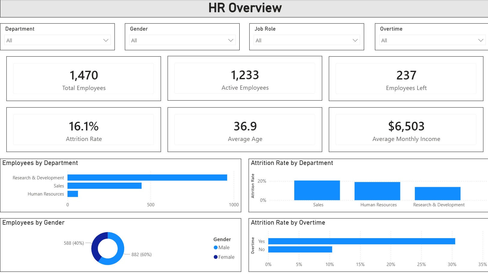
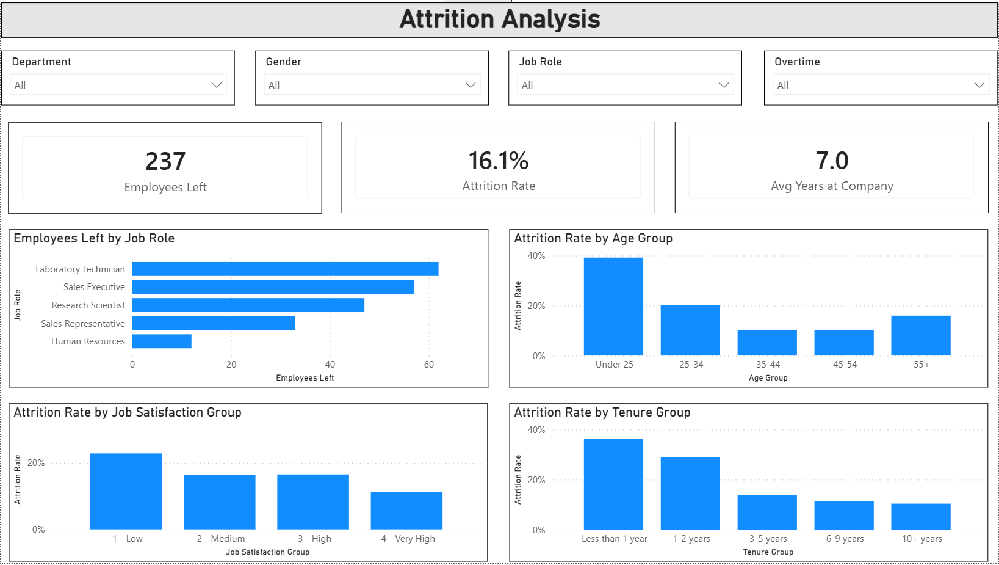
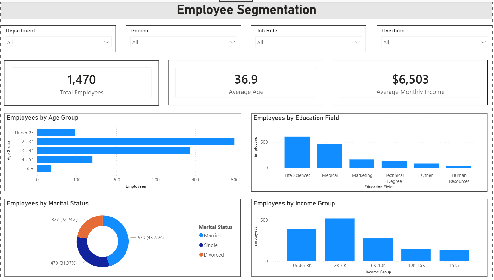
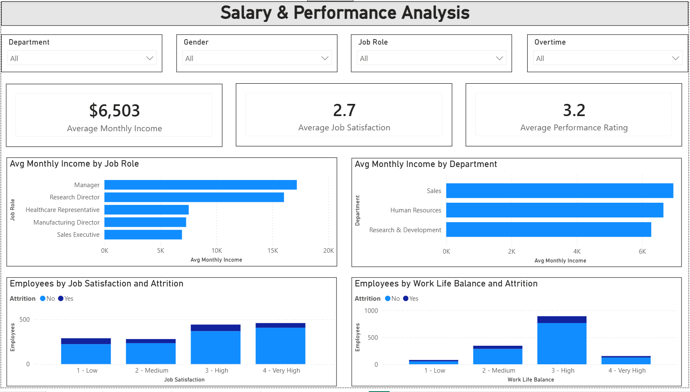

# Power BI HR Analytics Dashboard

## Project Overview

This Power BI project analyzes employee attrition, workforce structure, salary distribution, job satisfaction, work-life balance, and performance-related HR indicators.

The dashboard was created to help understand key HR metrics such as total employees, active employees, attrition rate, average age, average monthly income, employee segmentation, and factors that may be related to employee turnover.

The project focuses not only on presenting HR data visually, but also on identifying employee groups with higher attrition risk and generating practical business insights for HR decision-making.

## Business Questions

This project answers the following business questions:

1. What is the overall employee attrition rate?
2. How many employees are active and how many have left the company?
3. Which departments and job roles have the highest employee attrition?
4. How does attrition differ by age group and tenure?
5. Does overtime relate to higher employee attrition?
6. Which employee groups are more likely to leave the company?
7. How are employees distributed by age, education, marital status, and income group?
8. Which job roles and departments have the highest average monthly income?
9. How do job satisfaction and work-life balance relate to attrition?
10. What workforce segments may require more attention from HR?

## Tools Used

* Power BI
* Power Query
* DAX
* Data visualization
* HR analytics
* Dashboard design
* GitHub project documentation

## Dataset

The project uses the IBM HR Analytics Employee Attrition dataset.

The dataset includes employee-related information such as:

* Age
* Gender
* Department
* Job Role
* Monthly Income
* Job Satisfaction
* Work Life Balance
* Performance Rating
* Overtime
* Years at Company
* Business Travel
* Education Field
* Marital Status
* Attrition status

## Dashboard Pages

### 1. HR Overview

The HR Overview page provides a high-level summary of the workforce and key attrition indicators.

It includes:

* Total Employees
* Active Employees
* Employees Left
* Attrition Rate
* Average Age
* Average Monthly Income
* Employees by Department
* Attrition Rate by Department
* Employees by Gender
* Attrition Rate by Overtime



### 2. Attrition Analysis

The Attrition Analysis page focuses on employee turnover and identifies groups with higher attrition risk.

It includes:

* Employees Left
* Attrition Rate
* Average Years at Company
* Employees Left by Job Role
* Attrition Rate by Age Group
* Attrition Rate by Job Satisfaction
* Attrition Rate by Tenure Group



### 3. Employee Segmentation

The Employee Segmentation page shows the structure of employees across different demographic and professional groups.

It includes:

* Total Employees
* Average Age
* Average Monthly Income
* Employees by Age Group
* Employees by Education Field
* Employees by Marital Status
* Employees by Income Group



### 4. Salary & Performance Analysis

The Salary & Performance Analysis page focuses on income, satisfaction, performance, and work-life balance.

It includes:

* Average Monthly Income
* Average Job Satisfaction
* Average Performance Rating
* Average Monthly Income by Job Role
* Average Monthly Income by Department
* Employees by Job Satisfaction and Attrition
* Employees by Work Life Balance and Attrition



## Key Insights

### 1. Overall attrition rate

The overall employee attrition rate is **16.1%**.

This means that around one in six employees in the dataset left the company.

### 2. Overtime is strongly related to attrition

Employees who work overtime have a much higher attrition rate than employees who do not work overtime.

* Attrition rate for employees with overtime: approximately **30.5%**
* Attrition rate for employees without overtime: approximately **10.4%**

This suggests that overtime may be one of the strongest risk indicators for employee turnover in this dataset.

### 3. Sales and technical roles account for many attrition cases

Laboratory Technicians and Sales Executives account for the highest number of employees leaving.

This suggests that HR should pay closer attention to roles with a high number of attrition cases, especially when combined with other risk factors such as overtime, shorter tenure, or lower job satisfaction.

### 4. Younger employees have the highest attrition rate

Employees in the **Under 25** age group show the highest attrition rate compared to other age groups.

This may suggest that younger employees are more likely to change jobs, especially early in their careers.

### 5. Employees with shorter tenure are more likely to leave

Attrition is highest among employees with less than 2 years at the company.

This suggests that the first years of employment may be critical for employee retention.

### 6. Certain job roles account for more employees leaving

Laboratory Technicians and Sales Executives account for the highest number of employees leaving.

This does not necessarily mean that these roles have the highest attrition rate, but they represent a large number of attrition cases.

### 7. Lower job satisfaction is associated with higher attrition

Employees with lower job satisfaction show a higher tendency to leave the company.

This suggests that monitoring job satisfaction may help HR identify potential retention risks.

### 8. Monthly income differs significantly by job role

Average monthly income varies significantly by job role.

Managers and Research Directors have the highest average monthly income, while several operational roles have lower average income levels.

## Business Recommendations

Based on the analysis, the following recommendations can be considered:

1. **Monitor overtime more closely**
   Employees working overtime show much higher attrition. HR teams should review overtime workload, especially in departments and job roles with high turnover.

2. **Focus on early-tenure employees**
   Employees with less than 2 years at the company show higher attrition. Onboarding, mentoring, and early engagement programs may help reduce turnover.

3. **Investigate attrition in sales-related roles**
   Sales employees, especially those working overtime, may require additional attention, workload review, or retention initiatives.

4. **Track job satisfaction regularly**
   Lower job satisfaction is associated with higher attrition. Regular employee feedback surveys could help identify risks earlier.

5. **Support younger employees**
   Employees under 25 show the highest attrition rate. Career development, training, and clearer growth paths may help improve retention.

## DAX Measures

The project includes custom DAX measures for employee counts, attrition analysis, averages, and display formatting.

Main measures include:

* Total Employees
* Active Employees
* Employees Left
* Attrition Rate
* Average Age
* Average Monthly Income
* Average Years at Company
* Average Job Satisfaction
* Average Performance Rating
* Average Work Life Balance

Display measures were also created to format KPI cards and avoid automatic number abbreviation in Power BI.

More details are available in the [DAX measures documentation](dax-measures.md).

## Calculated Columns

The project also includes calculated columns used for grouping and sorting values in the dashboard:

* Age Group
* Age Group Sort
* Tenure Group
* Income Group
* Income Group Sort
* Job Satisfaction Group
* Job Satisfaction Sort
* Work Life Balance Group
* Work Life Balance Sort

These columns were used to make the visualizations more readable and to ensure correct sorting of grouped values.

## Skills Demonstrated

* Building a multi-page Power BI dashboard
* Cleaning and transforming HR data in Power Query
* Creating custom DAX measures
* Creating calculated columns for grouping and sorting
* Designing KPI cards and interactive slicers
* Analyzing employee attrition
* Identifying high-risk workforce segments
* Creating workforce segmentation analysis
* Analyzing salary, satisfaction, and work-life balance indicators
* Presenting business insights and recommendations
* Documenting a Power BI portfolio project on GitHub

## Repository Structure

```text
power-bi-hr-analytics-dashboard/
│
├── README.md
├── dax-measures.md
├── hr-analytics-dashboard.pbix
│
├── data/
│   └── WA_Fn-UseC_-HR-Employee-Attrition.csv
│
└── screenshots/
    ├── hr-overview.png
    ├── attrition-analysis.png
    ├── employee-segmentation.png
    └── salary-performance-analysis.png
```

## Conclusion

This project demonstrates how Power BI can be used to analyze HR data, monitor employee attrition, explore workforce segmentation, and present business insights through interactive dashboards.

The analysis highlights that overtime, age, tenure, job role, and job satisfaction may be important factors related to employee attrition. The dashboard can help HR teams better understand workforce risks and support data-driven employee retention decisions.
